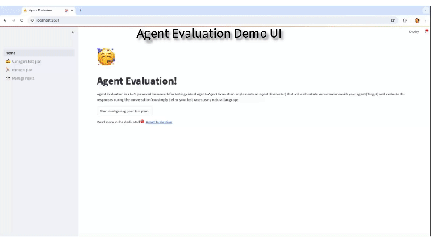

# Demo Agent Evaluation

This directory provides a Web UI for evaluating and interacting with AI agents using the AgentEval framework. You can run the Agent Evaluation Demo locally on your server.

## Prerequisites

Before running the demo, ensure that you have the following dependencies installed:

- Python (version 3.9 or later)
- pip (Python package installer)

## Deployment
1. **Clone the repository**: Clone `agent-evaluation` repository from GitHub.

    ```
    git clone https://github.com/awslabs/agent-evaluation.git
    ```

3. **Change to demo directory**: Change directory to `agent-evaluation/demo`

    ```
    cd agent-evaluation/demo
    ```

2. **Create a virtual environment**

    ```
    python3 -m venv env
    source env/bin/activate
    ```

3. **Install Requirements**: The demo app has dependencies listed in the `requirements.txt` file. Install them using pip:

   ```
   pip install -r requirements.txt
   ```


5. **Run Demo Web UI**: Streamlit is the framework used for building the interactive Web UI. Run the following command to start the Streamlit server

    ```
    streamlit run Home.py
    ```

6. **Access the Web UI**: Once the server is running, it will provide you with a local URL (e.g., `http://localhost:8501`) where you can access the Agent Evaluation Demo Web UI in your web browser.

## Usage

The Demo Web UI allows you to interact with Agent Evaluation in an interactive way. It also uses local Sqlite DB and file diretories to store manage past test runs.

The demo provides a user-friendly interface where you can:

- Upload and configure your test plan
- Run your test plan
- View past test run results



