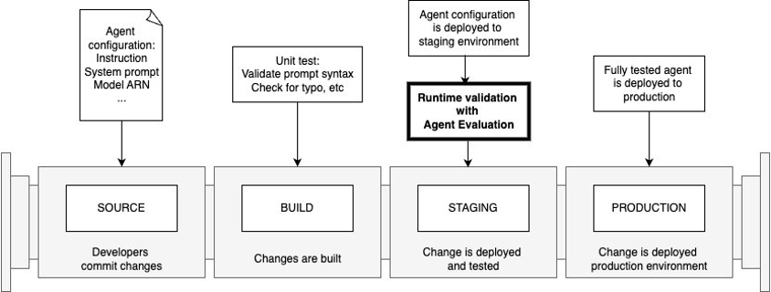

# Integration with CI/CD Pipelines

After validating the functionality in the development account, you can commit the code to the repository and initiate the deployment process for the virtual agent to the next stage. Seamless integration with CI/CD pipelines is a crucial aspect of Agent Evaluation, enabling comprehensive integration testing to ensure that no regressions are introduced during new feature development or updates. This rigorous testing approach is vital for maintaining the reliability and consistency of virtual agents as they progress through the software delivery lifecycle.

By incorporating Agent Evaluation into CI/CD workflows, organizations can automate the testing process, ensuring that every code change or update undergoes thorough evaluation before deployment. This proactive measure minimizes the risk of introducing bugs or inconsistencies that could compromise the virtual agent's performance and the overall user experience.

## CI/CD workflow

The figure below shows what a standard agent CI/CD pipeline looks like:



1.	The source repository stores the agent configuration, including agent instructions, system prompts, model configuration, etc. You should always commit your changes to ensure quality and reproducibility.
2.	When you commit your changes, a build step is triggered. This is where unit tests should run and validate the changes, including typo and syntax checks.
3.	When the changes are deployed to the staging environment, Agent Evaluation should run with a series of test cases for runtime validation.
4.	The runtime validation on the staging environment will help build confidence to deploy the fully tested agent to production.

## Step-by-step GitHub Actions setup

We have built an example with GitHub Actions, please take a look at the [Github workflow](https://github.com/awslabs/agent-evaluation/actions/workflows/cicd-demo.yml). Here is the step-by-step setup guide:

1.	Write a series of test cases following the [agent-evaluation test plan syntax](../user_guide.md). Store test plans in the git repository. For example, a test plan to test a Bedrock agent target is written as follows, with `BEDROCK_AGENT_ALIAS_ID` and `BEDROCK_AGENT_ID` as placeholders:

    ```
    evaluator:
    model: claude-3
    target:
        bedrock_agent_alias_id: BEDROCK_AGENT_ALIAS_ID
        bedrock_agent_id: BEDROCK_AGENT_ID
    type: bedrock-agent
    tests:
        InsuranceClaimQuestions:
        ...
    ```

2.	Create an IAM user with proper permissions:
    1. The principal must have `InvokeModel` permission to the model specified in the configuration.
    2. The principal must have the permissions to call the target agent. Depending on the target type, different permissions are required. Please visit the [agent-evaluation Target docs](../targets/index.md) for details.
3.	Store the IAM credentials (`AWS_ACCESS_KEY_ID` and `AWS_SECRET_ACCESS_KEY`  ) in GitHub Actions secrets. 
4.	Configure a GitHub workflow  as follows:
    ```
    name: CI/CD example

    on:
    push:
        branches: [ "main" ]

    env:
    AWS_REGION: us-east-1                   # set this to your preferred AWS region, e.g. us-west-1
    

    permissions:
    contents: read

    jobs:
    deploy:
        runs-on: ubuntu-latest

        steps:
        - name: Checkout
        uses: actions/checkout@v4

        - name: Configure AWS credentials
        uses: aws-actions/configure-aws-credentials@v4
        with:
            aws-access-key-id: ${{ secrets.AWS_ACCESS_KEY_ID }}
            aws-secret-access-key: ${{ secrets.AWS_SECRET_ACCESS_KEY }}
            aws-region: ${{ env.AWS_REGION }}

        - name: Install agent-evaluation
        run: |
            pip install agent-evaluation
            agenteval --help
        - name: Test Bedrock Agent
        id: test-bedrock-agent
        env:
            BEDROCK_AGENT_ALIAS_ID: ${{ vars.BEDROCK_AGENT_ALIAS_ID }}
            BEDROCK_AGENT_ID: ${{ vars.BEDROCK_AGENT_ID }}
        run: |
            sed -e "s/BEDROCK_AGENT_ALIAS_ID/$BEDROCK_AGENT_ALIAS_ID/g" -e "s/BEDROCK_AGENT_ID/$BEDROCK_AGENT_ID/g" <path-to-the-test-plan-template-file> > agenteval.yml
            agenteval run
        - name: Test Summary
        if: always()
        id: test-summary
        run: |
            if [ -f agenteval_summary.md ]; then
            cat agenteval_summary.md >> $GITHUB_STEP_SUMMARY
            fi
    ```
