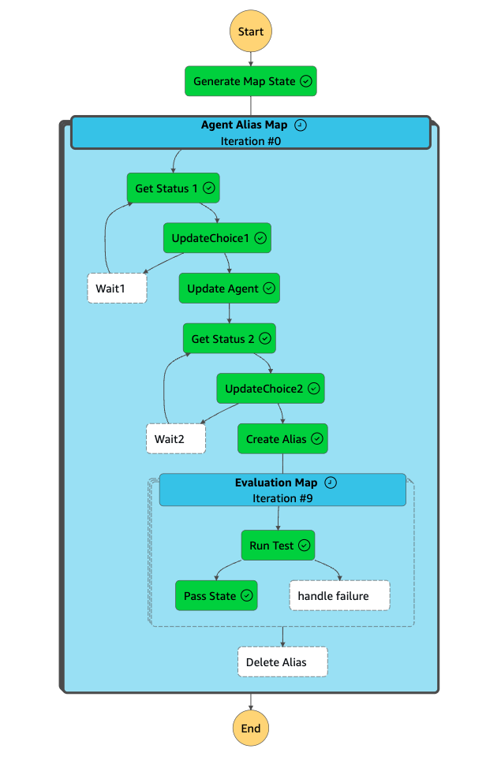

# Bedrock Agent Evaluation Step Functions Deployment

This project implements an automated evaluation framework for Amazon Bedrock Agents using AWS CDK, Step Functions, and Lambda.

## Overview

The framework automates the process of updating Bedrock Agents with new prompts, creating aliases, running evaluation scenarios, and cleaning up resources. It uses AWS Step Functions to orchestrate the workflow and AWS Lambda functions to perform individual tasks.

The example provided is for an energy chatbot usecase. We have provded three versions of **agent instruction** as `prompts` in the [example](example_prompt_jsons/prompts_scenarios.json). For each version, the framework will automatically create new Agent alias and test different scenarios and update the agent.


## Components

1. **CDK Stack (StepfunctionsStack)**: Defines the infrastructure, including Lambda functions, Step Functions state machine, and associated IAM roles.

2. **Lambda Functions**:
   - `generate_map`: Generates evaluation scenarios from S3 input.
   - `check_agent_status_1` and `check_agent_status_2`: Check the status of Bedrock Agents.
   - `update_bedrock_agent`: Updates the Bedrock Agent with new instructions.
   - `create_alias`: Creates an alias for the updated agent.
   - `run_test`: Executes evaluation scenarios using the `agenteval` library.
   - `delete_alias`: Removes the temporary alias after evaluation.

3. **Step Functions State Machine**: Orchestrates the evaluation workflow, including agent updates, status checks, and scenario execution.
   
   

4. **S3 Bucket**: Stores evaluation prompts and results.

5. **EventBridge Rule**: Triggers the Step Functions workflow when new evaluation prompts are uploaded to S3.

## Workflow
1. New evaluation prompts are uploaded to the S3 bucket.
2. The EventBridge rule triggers the Step Functions state machine.
3. The state machine updates the Bedrock Agent with new instructions.
4. An alias is created for the updated agent.
5. Evaluation scenarios are executed using the `agenteval` library.
6. Results are stored in the S3 bucket.
7. The temporary alias is deleted.

## Setup and Deployment

1. Ensure you have the AWS CDK installed and configured.
2. Install project dependencies:
   ```
   cd samples/aws_step_functions_deployment
   python3 -m venv .venv   
   source .venv/bin/activate
   pip install -r requirements.txt
   ```
3. Run CDK synth:
   ```
   cdk synth
   ```
4. Deploy the stack:
   ```
   cdk deploy
   ```

## Usage
To run an evaluation:
1. Create a Bedrock Agent (You don't need to configure it yet just simply create it). 
2. Prepare an evaluation JSON file with prompts and customer profiles as the [example](example_prompt_jsons/prompts_scenarios.json) (Replace the agent id and name with the one you have created in the file).
3. Upload the file to the S3 bucket `stepfunctionsstack-evaluationbucket` in the `evaluation_prompts/` prefix.
4. The evaluation process will start automatically.
5. Results will be available in the S3 bucket under the `results/` prefix.


## Notes

- Ensure proper IAM permissions are set up for accessing Bedrock, S3, and other AWS services.
- The `agenteval` library is assumed to be provided as a custom Lambda layer.

